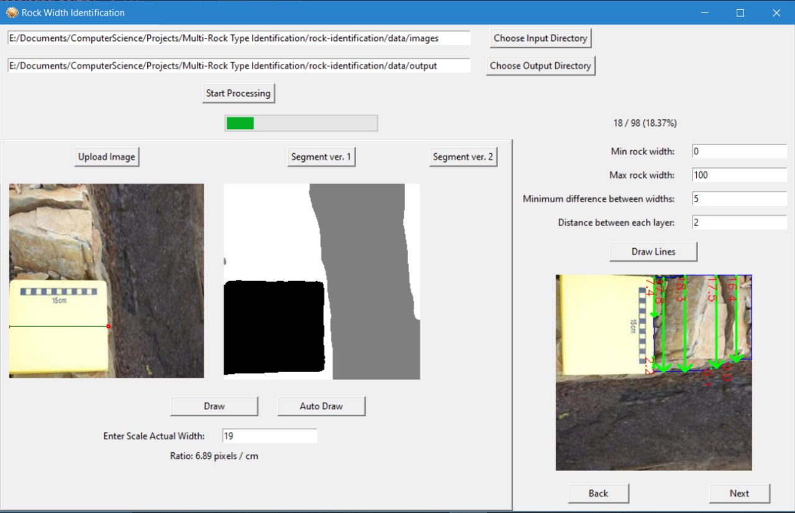

# Automated Thickness Measurement of Sedimentary Rocks

Tested on Python 3.8

1. `pip install -r requirements.txt`
2. `python -m main` or `python main.py`

A specialized desktop application using Tkinter and Python to automate the measurement of sedimentary rock layers, specifically mudstones and sandstones, in overhead imagery. The application leverages a finetuned SegFormer model for semantic segmentation to distinguish between mudstone, sandstone, and background elements in the images.

**Key Features:**

- **Semantic Segmentation**: Utilizes a SegFormer model trained on sedimentary rock images to segment mudstone, sandstone, and background regions.
  
- **Scale Calibration**: Employs a unique approach to calibrate the scale of the image by identifying a notebook of known width in the background. This allows for precise thickness measurements in real-world units.

- **Automated Line Drawing**: Implements contour tracing algorithms to draw multiple line segments across the segmented mudstone regions, providing a comprehensive thickness profile.

- **User-Friendly Interface**: Offers an intuitive Tkinter-based GUI for easy image upload and processing, complete with progress tracking.

**Technical Stack:**

- Python
- Tkinter for GUI
- OpenCV for image processing
- PyTorch for neural network inference
- Transformers library for SegFormer model

#### Relevance and Utility:

This application is particularly relevant to geologists, sedimentologists, and researchers engaged in the study of sedimentary rocks. It significantly reduces the time and effort required for manual annotation and measurement, thereby accelerating research and analysis. By providing a quick and accurate method for measuring mudstone thickness, the application aids in various geological studies, including sedimentary basin analysis, resource evaluation, and paleoenvironmental reconstruction.

By automating a traditionally labor-intensive process, this application not only enhances efficiency but also increases the accuracy and consistency of the measurements, making it an invaluable tool in the field of sedimentary geology.
